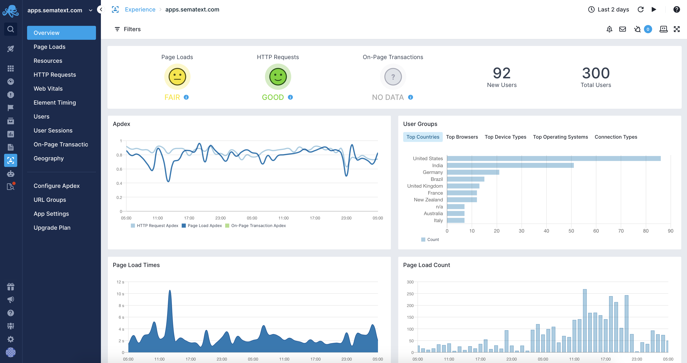

# Sematext Browser SDK
Repository containing the Browser SDK for the [Sematext Experience](https://sematext.com/experience/). It is used to collect end-user data from browsers using various browser APIs. It is designed to work with traditional web applications as well as single-page apps (SPAs). The collected data includes:

 - Page load metrics,
 - HTTP requests metrics,
 - Page resources metrics,
 - [Long tasks metrics](https://sematext.com/docs/experience/longtasks/),
 - [Web Vitals metrics](https://sematext.com/docs/experience/webvitals/),
 - [Element timing metrics](https://sematext.com/docs/experience/element-timing/),
 - [User metrics](https://sematext.com/docs/experience/user-identification/),
 - [On-page transaction metrics](https://sematext.com/docs/experience/on-page-transaction/).

 

## Development

The RUM script is developed using [ECMAScript 2015](https://en.wikipedia.org/wiki/ECMAScript). For builds and development it uses:
 
 - `npm` - [Node package manager](https://npm.org)
 - `yarn` - [Package dependency manager](https://yarnpkg.com)
 - `flow` - [Static type checker](https://flow.org)
 - `Cypress.io` - [Integration tests framework](https://www.cypress.io)

### The RUM Script Architecture

There are two parts of the RUM script: 

 - The loader script
 - The metrics gathering script

The loader script is responsible for loading the metrics gathering script. 
It adds the actual `<script>` tags with the content of the main metric script. 
The loader script keeps track and buffers commands that will be sent once the 
metrics gathering script loads and is configured.

**Please note that the loader and the RUM script depend on each other.
Before changing the scripts keep in mind that developers who have already added the script
to their website will use the older loader script unless they update it.**

### Working on the Loader Script

The main entry point of the loader script is in `src/snippet.js`. 
This is the unminified [ES2015]((https://en.wikipedia.org/wiki/ECMAScript)) version 
of the loader script which is responsible for loading the metrics gathering script. 

To generate the minified snippet of the loader script use `yarn run generate-snippet`.

**Keep in mind that the loader script should be compact.**

### Working on the Main RUM Script

The main entry point of the RUM script is in `src/index.js`. Use `eslint` to catch any 
style issues and `flow` to catch any type errors.

You can use the following commands:

 - `yarn run start` to start the development server
 - `yarn run lint` to run `lint` on the code
 - `yarn run flow` to run `flow` type checks
 - `yarn run build` to build the production bundle
 - `yarn run dev` to build the development (not minified) bundle

### Manual Tests

You can test the loader and RUM scripts using one of the ***test*** websites that are provided:

 - `test.html` - simple app that can be used to generate page load events and HTTP requests 
 - `testspa.html` - simple single-page app used to generate `routeChange` events and HTTP requests 
 - `large.html` - app used for testing large requests sent from the RUM script
 - `e2e.html` - app used for most of the integration tests 

Run `yarn run start` to run a small test website which runs the dev
version of the RUM script. After making changes to the script, reload the
website to see the changes. 

If you wish to automatically test single page applications there is a second test application
called `spa.html` (see `testspa.html` file) which you start by running `yarn run start`. It 
automatically runs `routeChange` commands every 10 seconds and HTTP requests every 5 seconds.

### Automatic Tests

[Cypress.io](https://www.cypress.io) is used for automatic testing. The integration
tests are included in the `cypress/integration/` directory and cover all the crucial
features of the script itself. The tests are using the same set of HTML files used 
by the manual tests.  

To run the full set of tests run `yarn e2e`. The results will include a table with test
results similar to the following:

```
     Spec                                              Tests  Passing  Failing  Pending  Skipped
┌────────────────────────────────────────────────────────────────────────────────────────────────┐
│ ✔  buffer.spec.js                           00:10        1        1        -        -        - │
├────────────────────────────────────────────────────────────────────────────────────────────────┤
│ ✔  elementtiming.spec.js                    00:46        3        3        -        -        - │
├────────────────────────────────────────────────────────────────────────────────────────────────┤
│ ✔  integration.spec.js                      00:15        4        4        -        -        - │
├────────────────────────────────────────────────────────────────────────────────────────────────┤
│ ✖  large.spec.js                            00:05        1        -        1        -        - │
├────────────────────────────────────────────────────────────────────────────────────────────────┤
│ ✔  longtask.spec.js                         00:30        2        2        -        -        - │
├────────────────────────────────────────────────────────────────────────────────────────────────┤
│ ✔  transactions.spec.js                     00:15        1        1        -        -        - │
├────────────────────────────────────────────────────────────────────────────────────────────────┤
│ ✔  web-vitals.spec.js                       00:10        1        1        -        -        - │
└────────────────────────────────────────────────────────────────────────────────────────────────┘
  ✖  1 of 7 failed (14%)                      02:15       13       12        1        -        -
```

## Sending data to multiple receivers 

In order to configure the RUM script to send data to multiple RUM receivers you
need to add the RUM snippet multiple times. Only the first snippet should have
URL to the RUM script set so that it's loaded only once, for example:

```html
<script type="text/javascript">
  ...
  INSERT SCRIPT SNIPPET HERE
  ...
  (window,document,"script","/rum.js","strumTest");
</script>
<script type="text/javascript">
  ...
  INSERT SCRIPT SNIPPET HERE
  ...
  (window,document,"script",null,"strumUS");
</script>

<script type="text/javascript">
  window.STRUM_CONTEXTS = ['strumTest', 'strumUS'];
  var receivers = [
    'https://rum-receiver.test.sematext.com',
    'https://rum-receiver.sematext.com',
  ]
  strumTest('config', {
    token: 'b12s3ssd-d11s-2d39-7231-f3s22grd635f',
    receiverUrl: receivers[0],
    ignoreOrigins: receivers,
  });
  strumUS('config', {
    token: '8763d12d-1j3t-932v-b498-544290z98k43',
    receiverUrl: receivers[1],
    ignoreOrigins: receivers,
  });
</script>
```

## Contributing

Pull requests for bug fixes, improvements and new features are more than welcome. When opening a new pull request please take the time to briefly describe the changes. Make sure that the newly introduced code passes the `lint` and `flow` checks along with the integration tests. Once the PR is submitted we will review and merge your changes.
